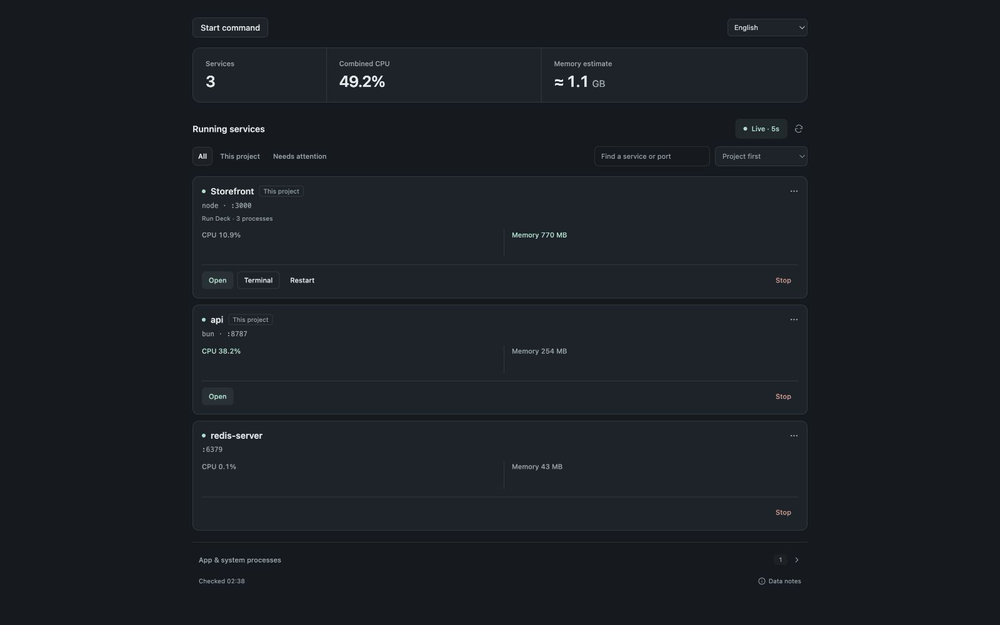

# Run Deck

A service dashboard for Muxy on macOS. Discover running service trees, inspect CPU and memory, open local pages, and stop or restart verified launches. Start project scripts or saved commands in interactive Muxy terminals.



English, Simplified Chinese, French, German, Spanish, Brazilian Portuguese and Korean are supported. The language menu remembers your choice. Screenshots use synthetic service data; [light theme](public/assets/screenshot-light.png).

## Requirements and behavior

Tested in Muxy 1.6.0. Process inspection requires a macOS execution host; Linux/SSH inspection is unsupported. Live checks run every five seconds while visible, pause during actions/dialogs, and stop after interrupted consent. Only one inspection runs at a time. CPU and RSS estimates include observed descendants; shared memory can be counted more than once. TCP listening is not a health check.

Stop rechecks host, user, process identities, descendant membership and ports after consent, then sends SIGTERM to verified PIDs. No force kill. Outside-worktree actions need additional confirmation. Restart is available only for a tracked Run Deck launch and checks old-process exit and port availability before starting once. These checks cannot eliminate every scheduling race or track detached workers.

## Permissions and privacy

| Permission | Purpose |
| --- | --- |
| `panels:write` | Show the service panel. |
| `projects:read`, `worktrees:read` | Identify the active worktree and label its services. |
| `commands:exec` | Inspect listener trees and resources; stop verified processes for user-requested Stop/Restart. |
| `storage:read`, `storage:write` | Save commands, terminal links, custom URLs, and browser-host choices. |
| `tabs:read`, `tabs:write` | Start commands in Muxy terminals and revisit their output. |
| `files:read` | Discover package scripts and the package manager. |
| `browser:write` | Open the selected service URL. |

No telemetry, uploaded process data, external font downloads, or remote code loading. Inspection uses a temporary private file that is removed when the scan finishes. Launch markers are extracted on the host; full process arguments and environments are not sent to the panel. Each saved launch has a foreground shell wrapper for identity tracking; there is no daemon, background extension runtime, or copied terminal-log buffer. Custom URLs and saved command text stay in Muxy’s extension storage; avoid putting credentials in commands or URLs.


## Build

Use Node 20.19+ on the 20.x line, or Node 22.12+:

```sh
npm ci
npm run build
```

Load the resulting `dist/` directory through Muxy's **Extensions → Load Unpacked** for local development. Node is not needed to run the installed extension.

## Source and verification

This submission contains the readable runtime source and assets from [Run Deck 0.3.0](https://github.com/DarinRowe/run-deck/tree/v0.3.0), with marketplace-specific documentation and build-only npm scripts. Tests, CI, architecture, native verification evidence and development history stay in the source repository:

- [Usage and development](https://github.com/DarinRowe/run-deck/blob/v0.3.0/README.md)
- [Tests](https://github.com/DarinRowe/run-deck/tree/v0.3.0/tests)
- [Verification evidence and limitations](https://github.com/DarinRowe/run-deck/blob/v0.3.0/docs/VALIDATION.md)
- [Release notes](https://github.com/DarinRowe/run-deck/blob/v0.3.0/docs/releases/0.3.0.md)

[MIT](LICENSE) © 2026 DarinRowe. Developed with OpenAI Codex.
